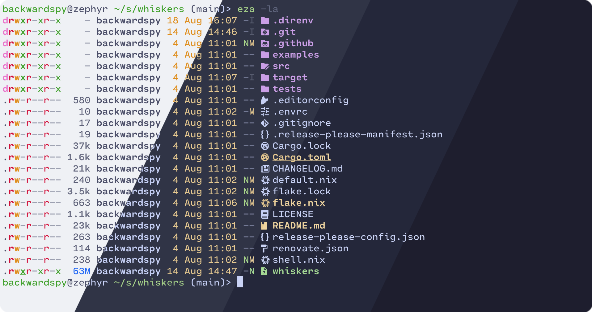
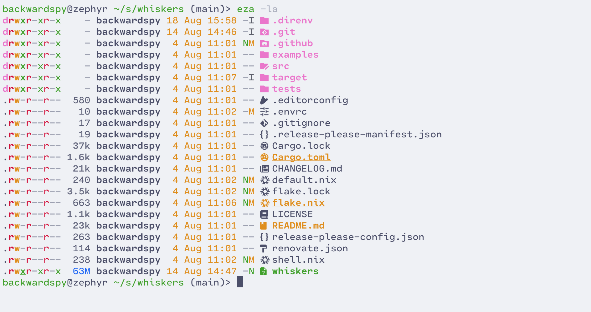
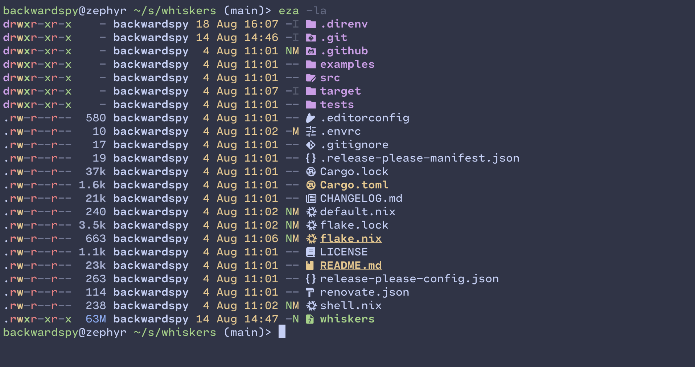
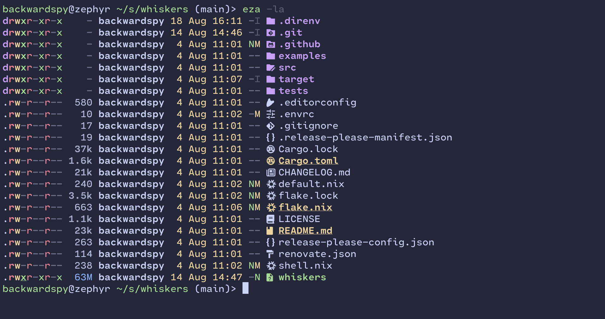

<h3 align="center">
	<br/>
	
	Catppuccin for <a href="https://github.com/eza-community/eza">eza</a>
	
</h3>

<p align="center">
	<a href="https://github.com/catppuccin/eza/stargazers"></a>
	<a href="https://github.com/catppuccin/eza/issues"></a>
	<a href="https://github.com/catppuccin/eza/contributors"></a>
</p>

<p align="center">
	
</p>

## Previews

<details>
<summary>🌻 Latte</summary>

</details>
<details>
<summary>🪴 Frappé</summary>

</details>
<details>
<summary>🌺 Macchiato</summary>

</details>
<details>
<summary>🌿 Mocha</summary>

</details>

## Usage

1. Copy content of theme with your favourite flavor and accent in [themes](./themes) directory (e.g. [themes/mocha/catppuccin-mocha-mauve.yml](./themes/mocha/catppuccin-mocha-mauve.yml) for Mocha with Mauve accent)
2. Paste it to your theme config. Read in [man](https://github.com/eza-community/eza/blob/main/man/eza.1.md#eza_config_dir) where it is located
3. Run eza and enjoy new look

## Building

This port uses [whiskers](https://github.com/catppuccin/whiskers) to generate themes. So, you need to edit [`eza.tera` template](./eza.tera) and then run

```sh
whiskers eza.tera
```
to generate themes in `themes` directory.

## Generating previews

This port uses [catwalk](https://github.com/catppuccin/catwalk) to generate previews. To generate preview, you need to update `[flavor].webp` in [`assets` directory](./assets/) and tyen run following command:
```sh
catwalk -C assets
```
to generate [`assets/preview.webp`](./assets/preview.webp).

## 💝 Thanks to

- [Andrey (ankddev)](https://github.com/ankddev)

&nbsp;

<p align="center">
	
</p>

<p align="center">
	Copyright &copy; 2021-present <a href="https://github.com/catppuccin" target="_blank">Catppuccin Org</a>
</p>

<p align="center">
	<a href="https://github.com/catppuccin/catppuccin/blob/main/LICENSE"></a>
</p>
